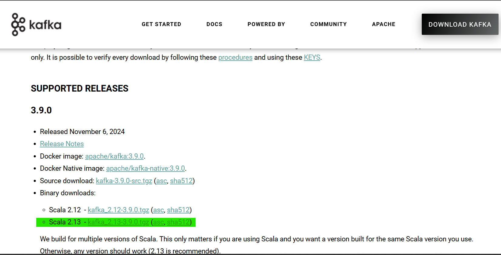
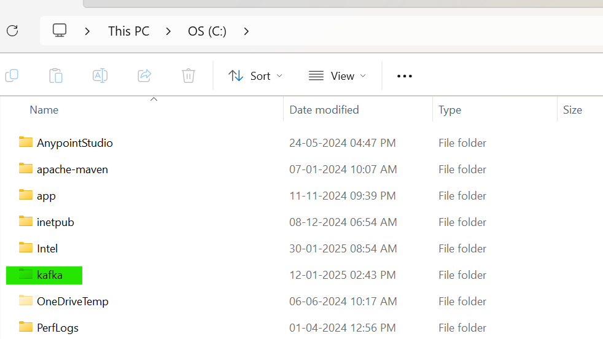

# Kafka Installation and Setup Guide on Windows

This guide provides step-by-step instructions to install and configure Apache Kafka on a Windows machine using the Command Line Interface (CLI) via CMD. Apache Kafka is a distributed streaming platform, and this setup uses the built-in ZooKeeper for coordination.

## Prerequisites

1. **Java Development Kit (JDK)**: Kafka requires Java 8 or higher.
2. **Apache Kafka Binary**: Download the Kafka binary distribution.
3. **Windows OS**: This guide is tested on Windows 10/11.

---

## Step 1: Check and Install Java JDK

Kafka runs on Java, so you need to verify if JDK is installed and install it if necessary.

1. **Check for Existing Java Installation**:

   - Open CMD and Check the Java version:

     ```cmd
     java -version
     ```

   - If installed, you’ll see output like:

     

   - If you get `'java' is not recognized`, proceed to download install JDK.

---

## Step 2: Download and Extract Kafka

1. **Download Kafka**:

   - Go to the [Apache Kafka Downloads page](https://kafka.apache.org/downloads).
   - Download the latest binary (e.g., `kafka_2.13-3.9.0.tgz`).

     

2. **Extract Kafka**:

   - Use a tool like 7-Zip to extract `kafka_2.13-3.9.0.tgz` to `C:\kafka`.
   - Extract it and rename directory as `kafka` and place it in `C Drive`.

     

3. **Verify Extraction**:

   - Navigate and open the Kafka directory:
   - You should see directories like `bin`, `config`, and `libs`.

     

---

<!-- ## Step 3: Configure Kafka and ZooKeeper

1. **ZooKeeper Configuration**:

   - Open `C:\kafka\config\zookeeper.properties` in a text editor (e.g., Notepad).
   - Ensure `dataDir` is set:
     ```
     dataDir=C:/kafka/zookeeper-data
     ```
   - Create the directory:
     ```
     mkdir C:\kafka\zookeeper-data
     ```

2. **Kafka Server Configuration**:
   - Open `C:\kafka\config\server.properties` in a text editor.
   - Ensure `log.dirs` is set:
     ```
     log.dirs=C:/kafka/kafka-logs
     ```
   - Create the directory:
     ```
     mkdir C:\kafka\kafka-logs
     ```

**Screenshot**:

_Caption: Screenshot showing the created `zookeeper-data` and `kafka-logs` directories in File Explorer or CMD `dir` output._

--- -->

## Step 3: Start Zookeeper

1. **Open a New CMD Window and Start Zookeeper**:

   - Run:

     ```cmd
     C:\kafka\bin\windows\zookeeper-server-start.bat C:\kafka\config\zookeeper.properties
     ```

     

   - Keep this window open to see ZooKeeper logs.

     

---

## Step 4: Start Kafka Server

1. **Open Another CMD Window and Start Kafka**:

   - Run:

     ```cmd
     C:\kafka\bin\windows\kafka-server-start.bat C:\kafka\config\server.properties
     ```

     

   - Keep this window open to see Kafka logs.

---

## Step 5: Create a Kafka Topic

1.  **Open a New CMD Window and Create a Topic**:

    - Create `test-topic`:

      ```
      C:\kafka\bin\windows\kafka-topics.bat --create --topic test-topic --bootstrap-server localhost:9092 --partitions 1 --replication-factor 1
      ```

    - Output:

      

2.  **List Topics**:

    - Verify:

      ```cmd
      C:\kafka\bin\windows\kafka-topics.bat --list --bootstrap-server localhost:9092
      ```

    - Output:

      

---

## Step 6: Test Kafka with Producer and Consumer

1.  **Start a Producer**:

    - Run:

      ```cmd
      C:\kafka\bin\windows\kafka-console-producer.bat --topic test-topic --bootstrap-server localhost:9092
      ```

    - Type messages (e.g., `Hello Kafka`) and press Enter.

      

2.  **Start a Consumer**:

    - Run:

      ```cmd
      C:\kafka\bin\windows\kafka-console-consumer.bat --topic test-topic --from-beginning --bootstrap-server localhost:9092
      ```

    - See the messages from the producer.

      

---

## Step 7: Set Up Kafka UI

1. **Download Kafka UI JAR**:

   - Visit [https://github.com/provectus/kafka-ui/releases](https://github.com/provectus/kafka-ui/releases).
   - Download the latest `.jar` file (e.g., `kafka-ui-0.7.2.jar`).

     

2. **Rename the JAR**: Rename the downloaded file to `kafka-ui.jar` for simplicity.
3. **Create `properties.yaml`**:

   - Open a text editor (e.g., Notepad) and paste the following configuration:

     ```yaml
     kafka:
       clusters:
         - name: local
           bootstrap-servers: localhost:9092
           zookeeper: localhost:2181
     server:
       port: 8082
     auth:
       type: DISABLED
     ```

   - Save the file as `properties.yaml` in a folder (e.g., `C:\kafka`).

   _Alternatively_, download the `properties.yaml` file directly:

   - [Download app.yaml](https://github.com/Danish2511/documentation/blob/main/Kafka/images/app.yaml)

4. **Organize Files**: Place both `kafka-ui.jar` and `properties.yaml` in the same folder (e.g., `C:\kafka`).
5. **Run Kafka UI**:

   - Open a new Command Prompt window.
   - Navigate to the folder:

     ```cmd
     cd C:\kafka
     ```

   - Execute the following command:

     ```cmd
     java -jar kafka-ui.jar --spring.config.location=app.yaml
     ```

     

   - Keep this window open; Kafka UI will start.

6. **Access the UI**:
   - Open a web browser and go to `http://localhost:8082`.
   - You should see the Kafka UI dashboard displaying your local cluster, topics, and brokers.

---

## Step 8: Stop Kafka, ZooKeeper and Kafka UI

1. **Stop Kafka Server**:

   - Go to the Kafka server CMD window and press `Ctrl+C`.

     

2. **Stop ZooKeeper**:

   - Go to the ZooKeeper CMD window and press `Ctrl+C`.

     

3. **Stop Kafka UI**:

   - Go to the Kafka UI CMD window and press `Ctrl+C`.

---
